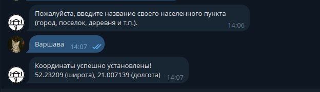
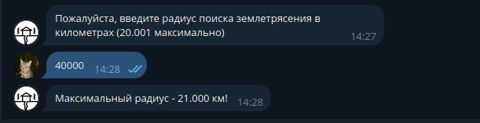

# Чат-бот с землетрясениями

Проект представляет собой телеграм бота, который имеет функционал поиска и отслеживания актуальных землетрясений.
Работа написана одним человеком в целях саморазвития и выполнения учебного проекта.
Прочитав эту документацию вы сможете запустить данного бота у себя на устройстве, предворительно поняв как его настроить и использовать функционал на максимум.

## Установка бота и зависимостей

**Внимание!**
В зависимости от системы, команды ниже могут отличаться, поэтому я буду приводить лишь основные варианты.

### Репозиторий

Для начала работы вам стоит скопировать удаленный репозиторий к себе на компьюетр командой ниже.
```bash
git clone https://github.com/Nick536363/Earthquake_Bot
```
Если же у вас не установлена *система контроля версий Git*, вам следуют выполнить шаги ниже.

Пользователи *систем Windows* могут посетить [этот сайт](https://git-scm.com/).

Пользователи *UNIX систем* могут установить Git, введя команду ниже в своём терминале.

```bash
sudo apt install git # Для Debian подобных систем
sudo pacman -S git # Для Arch подобных систем
sudo brew install git # Для MacOS
```

Если же ни одна из комманд не соответствует вашей системе - посетите [этот сайт](https://git-scm.com/).

### Python и зависимости

Python3 должен быть установлен на вашем устройстве для работы этого бота.

В *системах Linux* всё обычно идет прямо из коробки, но если каким-то образом интерпретатор у вас еще не установлен то введите команду ниже в своём терминале.

```bash
sudo apt install python3 # Для Debian подобных систем
sudo pacman -S python3 # Для Arch подобных систем
sudo brew install python3 # Для MacOS
```

Если же Вы - обладатель *системы Windows*, то просто посетите [оффициальный сайт Python](https://www.python.org/).

Отлично! Теперь перейдем к установке зависимостей. Следуйте шагам ниже для установки всех зависимостей.

> #### Виртуальное окружение
> Для более удобной работы стоит создать виртуальной окружение и активировать его. На всех системах это делаеться почти одинаково, так что трудностей не возникнет
> Для начала перейдите в каталог с ботом
> ```bash
> cd Earthquake_Bot
> ```
> Теперь создадим виртуальное окружение и активируем его
> ```bash
> python -m venv myenv
> source myenv/bin/activate # Для UNIX систем
> ./myenv/Scripts/activate.bat # Для Windows систем
> ```
> Если в будущем нужно будет отключить виртуальное окружений, просто воспользуйтесь командой `deactivate`!

> #### Зависимости
> Теперь - когда виртуальной окружение активно то можно смело устанавливать все нужные пакеты командой ниже!
>```bash
> pip install -r requirements.txt
>```
> **Помните**, установленные вами пакеты работают до тех пор - пока активно виртуальное окружение!


### Настройка переменных окружения 

Скрипты используют две переменные окружения, в целях укрытия чувствительных данных. 

Для исправной работы бота создайте *файл с расширением .env*, и поместите туда следующее содержимое.
```python
YANDEX_API="Ваш Яндекс токен"
TELEGRAM_API="Ваш Телеграм токен"
```

Если же вы еще не получили нужные данные - то посетите [кабинет разработчика Яндекс](https://developer.tech.yandex.ru/services) и там подключите сервис
под названием *API Яндекс Локатор*, там же и получите свой токен. В случае с Телеграмом, используйте [бота BotFather](https://t.me/BotFather) для создания 
своего бота и получения его токена.


## Первый запуск

Когда все зависимости установлены, виртуальное окружение активировано, а переменным окружения заданы нужные значения - можно запускать бота!

В репозитории находяться два скрипта - в одном из них лежат функции для получения данных о землетрясениях, а второй являеться самим телеграм ботом, он то нам
и понадобится!

Для запуска бота, нужно выполнить команду ниже в вашем терминале

```bash
python earthquakes_bot.py
```

После этого следует перейти в телеграм и нажать на кнопку *Старт* либо же вписать команду `/start` в чат с ботом.


## Функционал бота

После запуска бота, вы должны получить сообщение о всех доступных командах, а также откроется меню с кнопками.

Это будет выглядеть примерно так


Далее будет описан функционал бота и как его применять.

### `📍 Установить местоположение` или же `/setplace`

Эта команда предназначена для того, чтобы задать местоположение пользователя.

После ввода команды нужно будет ввести название своего населенного пункта, после чего координаты будут установлены.



Если же населенный пункт не был найден, то координаты будут установлены на 0, 0 (по умолчанию).


### `⭕ Установить радиус поиска` или же `/setradius`

Все землетрясений так или иначе находяться в каком-то радиусе от заданного местоположения.

Так вот эта команда служит как раз таки для того, чтобы задать максимальный радиус поиска землетрясений от местоположения пользователя (в километрах).

После ввода команды нужно будет ввести число от 1 до 20.001, это и будет заданный вами радиус поиска.


Если же пользователь введет число больше максимального, либо введет не число - радиус не будет установлен.


